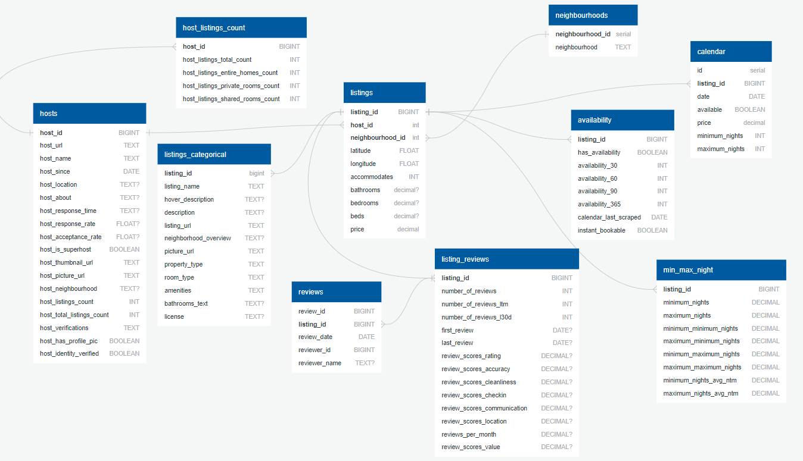

# Design Document

By Bryan Johns

Video overview: <URL HERE>

## Scope

In this section you should answer the following questions:

* What is the purpose of your database?

Build a database of AirBnB listings in Washington, DC, for use in a Jupyter notebook exploratory data analysis, a Tableau explanatory data analysis, and a web dashboard. It must be in PostgreSQL. It must contain the data necessary for a JavaScript map already made. I'm reverse-engineering this thing.

* Which people, places, things, etc. are you including in the scope of your database?

A plethora of information related to AirBnB listings, such as location, bed(/bath)rooms, amenities, pricing, host info, reviews, etc.

* Which people, places, things, etc. are *outside* the scope of your database?

This is a great question, but the reality is: anything not already in the data set. The maximum scope is pre-determined. But, I shall whittle away at the data collected and make note of it here, and set the minimum scope.

Information about renters. I have none. I can estimate demand, but know no demographics.

I know nothing about neighborhood features (well, the database doesn't).

## Functional Requirements

In this section you should answer the following questions:

* What should a user be able to do with your database?

Query the stats of AirBnB's in Washington, DC. Find out how many are in which neighborhood, and what kind of rental ("Full home"? "Private Room"?). It's for data analysis.

* What's beyond the scope of what a user should be able to do with your database?

Book an actual AirBnB. 

See current stats. It only updates as often as I chose to.

Change over time, although I may choose to continue to update this as new data is released.

Justify ignoring any data scrapped from the web here, like max/min nights.

## Representation

### Entities

In this section you should answer the following questions:

* Which entities will you choose to represent in your database?

Listings, hosts, neighborhoods, reviews, reviewers... pondering... I'll fill this in as I go along. A lot depends on the available data, and I'll decide what goes where afterwards. Make it lean. Keep only the essential data.

* What attributes will those entities have?

* Why did you choose the types you did?

Text, so it can be variable length to conserve hard disk storage.

* Why did you choose the constraints you did?

Often removed NULL constraint, to preserve more data, at least until I decide what to do with it.

### Relationships

In this section you should include your entity relationship diagram and describe the relationships between the entities in your database.

## Optimizations

In this section you should answer the following questions:

* Which optimizations (e.g., indexes, views) did you create? Why?

In the acronym of CRUD, I am functionally only interested in the 'R'. I'm biased towards speed of query results, as the data is being used to load a webpage. I will be the only one updating the database, and that infrequently, so the amount of time and complexity involved in updating doesn't bother me. I will keep a modest eye on the amount of hard disk memory storage taken up, but even that is mostly inconsequential to me.

Of course, having mentioned hard disk space as being mostly inconsequential to my needs, I deliberately excluded the actual review comments from the database. The text drastically increased storage space, adding almost 50% (90MB on top of 208MB). This saves on hard disk space and (presumably) speed of accessing the database on the reviews table. 

I partitioned off a lot of the listings data into separate categories to speed runtime. I created two tables for common numerical and categorical data, and then several other tables for less frequently accessed data.

The view `map_listings` created in the schema contains all of the fields necessary to populate a JavaScript map of the AirBnB's in DC, and also displaying some basic information at the neighbourhood level. This view returns data in 110-150 msec, vs. ~500 msec for v1.0 queries, cutting query time by at least a third.

To optimize joins, I built `idx_host_id` and `idx_neighbourhood_id` on the listings table, for the only columns used in making joins that aren't already primary keys. Using an index for purposes other than speeding joins, I built the `idx_lat_long` to optimize load time of the map, which has a marker for every listing.

Make efficient queries for the webpage's api calls.

## Limitations

In this section you should answer the following questions:

* What are the limitations of your design?

It takes up slightly more storage space, due to indexes. 

One big flaw is that it has to be updated manually, although much of that is automated.

Not really designed for create, update, delete - only read. CRUD disappointed.

Entirely static. Not dynamic. No realtime updates. Assumes listings and hosts do not change.

* What might your database not be able to represent very well?

Nothing realtime, like responding to changes in bookings.
