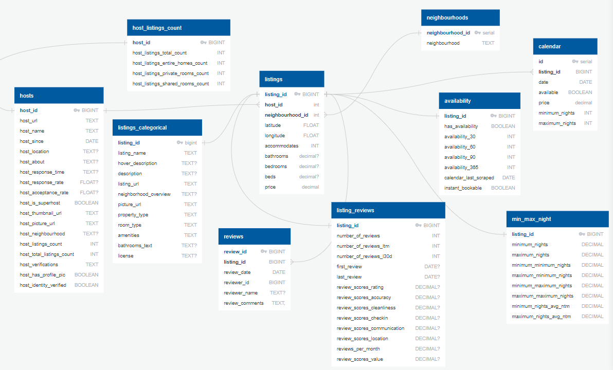

# Design Document

By Bryan Johns

Video overview: <URL HERE>

## Scope

In this section you should answer the following questions:

* What is the purpose of your database?

Data analysis. The database is for managing and analyzing data on AirBnB listings in Washington, DC. It's for use in a Jupyter notebook exploratory data analysis, a Tableau explanatory data analysis, and a web dashboard. I built it in PostgreSQL. It contains the data necessary for a JavaScript map in the web dashboard. It supports functionalities like viewing the individual listings on a map, understanding host behavior, and analyzing reviews, availability, and pricing. As such, it will be read-only for the general user, with myself commiting any updates.

* Which people, places, things, etc. are you including in the scope of your database?

**Listings** - Individual AirBnB listings and their details, like price, location, amenities. This data has been partitioned into mutiple tables, with common numerical and categorical data in two primary tables, and several side tables tracking the future availability of the listings, info on minimum and maximum number of nights and price, and average review scores for different aspects of each listing.

**Hosts** - Hosts of AirBnB listings and their associated data, like response and acceptance rate, and methods of verifying host identity. Partitioned out is a separate host table covering the amount and type of listings the host offers, for analyzing hosts with multiple listings.

**Neighbourhood** - A list of various DC neighbourhoods, which links to the listings.

**Reviews** - Info about each review of all listings.

**Calendar** - Records the price, availability and other details from the listing's calendar for each day of the next 365 days.

* Which people, places, things, etc. are *outside* the scope of your database?

AirBnB users who are not hosts, which I assume are guests - vacationers, business travelers, etc. I lack any detailed information about guests beyond reviews and reviewer names. This also includes AirBnB administrators / employees, and people who may have profiles but don't rent out spaces, like property maintenance staff and cleaners.

Listings outside of Washington, DC. This has a local focus on one city, and cannot contribute to a larger analysis of AirBnB on a country or global basis.

No information about transactions or bookings. Methods of payment, cancellations or refunds, timing of bookings, etc.

I know nothing about neighborhood features (well, the database doesn't - I live in DC), which could impact the price and popularity of listings.

## Functional Requirements

In this section you should answer the following questions:

* What should a user be able to do with your database?

Viewings lisiting on a map with detailed information (e.g., price, property type, host info).

Use the web dashboard to see stats on AirBnB's in DC and at the neighbourhood level.

View exploratory and explanatory data analyses in Jupyter and Tableau.

Conduct their own analysis on listings and their attributes.

Access review and availability statistics.

Basically, data analysis on hosts and listings.

* What's beyond the scope of what a user should be able to do with your database?

Book an actual AirBnB. In fact, there is no real-time info. The database is a snapshot in time, last scraped in June of 2024.

No information of transaction history. I don't know who rented what, when.

No user-specific features. It can't be customized depending upon a user's preferences.

## Representation

### Entities

In this section you should answer the following questions:

* Which entities will you choose to represent in your database?

* What attributes will those entities have?

* Why did you choose the types you did?

Data types were chosen to accurately represent each attribute, like FLOAT for `price` and `latitude`/`longitude`, or BOOLEAN for binary attributes, like `availability` and `host_identity_verified`. I used TEXT for strings, so it can be of variable length to conserve hard disk storage. I used BIGINT, as many of the numbers were large and needed extra hard disk space.

* Why did you choose the constraints you did?

Primary Keys to ensure uniqueness of each entity. Also because they are essential for each table.

Foreign keys to establish relationships between the entities.

The only other constraint I used was `NOT NULL`, to ensure some required fields were filled, like `price`. The Primary Keys ensured uniqueness enough for each entity. The only default value I had to set was created in Python (for price, based on the neighbourhood median). Check constraints were unnecessary.

### Relationships

In this section you should include your entity relationship diagram and describe the relationships between the entities in your database.

Hosts to Listings - One-to-Many (`host_id`)

Hosts to Host_Listings_Count - One-to-One (`host_id`)

Neighbourhoods to Listings - One-to-Many (`neighbourhood_id`)

Listings to Listings_Categorical - One-to-One (`listing_id`)

Listings to Availability - One-to-One (`listing_id`)

Listings to Min_Max_Night - One-to-One (`listing_id`)

Listings to Listing_Reviews - One-to-One (`listing_id`)

Listings to Reviews - One-to-Many (`listing_id`)

Listings to Calendar - One-to-Many (`listing_id`)

## Optimizations

In this section you should answer the following questions:

* Which optimizations (e.g., indexes, views) did you create? Why?

In the acronym of CRUD, I am functionally only interested in the 'R'. I'm biased towards speed of query results, as the data is being used to load a webpage. I will be the only one updating the database, and that infrequently, so the amount of time and complexity involved in updating doesn't bother me. I will keep a modest eye on the amount of hard disk memory storage taken up, but even that is mostly inconsequential to me.

I partitioned off a lot of the listings data into separate categories to speed runtime. I created two tables for common numerical and categorical data, and then several other tables for less frequently accessed data (availaiblity, minimum and maximum night, aggregate review statistics).

The view `map_listings` created in the schema contains all of the fields necessary to populate a JavaScript map of the AirBnB's in DC, and also displaying some basic information at the neighbourhood level. This view returns data in 110-150 msec, versus ~500 msec for my original version of the query, cutting query time by at least a third. Combining relevant information from multiple tables into one view allows me simplify my map query into one API call: 'SELECT * FROM map_listings'.

To optimize joins, I built `idx_host_id` and `idx_neighbourhood_id` on the listings table. These are the only columns used in making joins that aren't already primary keys, so it should speed queries involving those joins. 

Using an index for purposes other than speeding joins, I built the `idx_lat_long` to optimize load time of the map, which has a marker for every listing.

For any data used in the web dashboard plots, I created efficient queries to speed the loading of data.

## Limitations

In this section you should answer the following questions:

* What are the limitations of your design?

No optimizations to handle a high concurrency, a large volume of simultaneous users.

It takes up slightly more storage space, due to indexes, and a lot more storage space due to the inclusion of specific reviews and calendar data (review comments and the calendar table trebled the size of hard disk storage, from 100MB to 300MB). 

One big flaw is that it has to be updated manually. Much of that process has been automated, but I still have to start it.

It's not really designed for the user to create, update, and delete - only read, disappointing the CRUD acronym.

It's entirely static. Not dynamic. No real-time updates. It assumes listings and hosts do not change. It will only ever provide a snapshot, based upon the day the website was scraped.

* What might your database not be able to represent very well?

Nothing real-time, like responding to changes in bookings.

No information on guests, those who rent AirBnB's.
